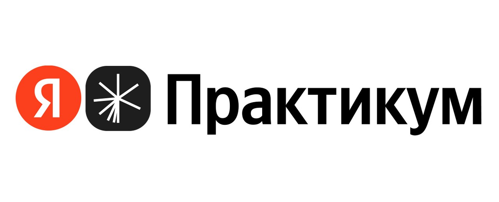

# Курс "Frontend-разработчик" от "Яндекс Практикума"
Все проекты хостятся на GitHub Pages, поэтому их можно протестировать.

## [Оно тебе надо](https://github.com/iannsgirdye/ono-tebe-nado-ad)
Лендинг, написанный только на **HTML** и **CSS** с использованием подключаемых шрифтов.

## [Посмотри в окно](https://github.com/iannsgirdye/posmotri-v-okno-ad)
Стилизация лендинга на **CSS** с готовыми разметкой на **HTML** и программным кодом **JS**.

## [Сложно сосредоточиться](https://github.com/iannsgirdye/slozhno-sosredotochitsya-ad)
Вёрстка адаптивного лендинга в светлой и тёмной темах на **HTML** и **CSS** с готовым **JS** для переключения темы.
